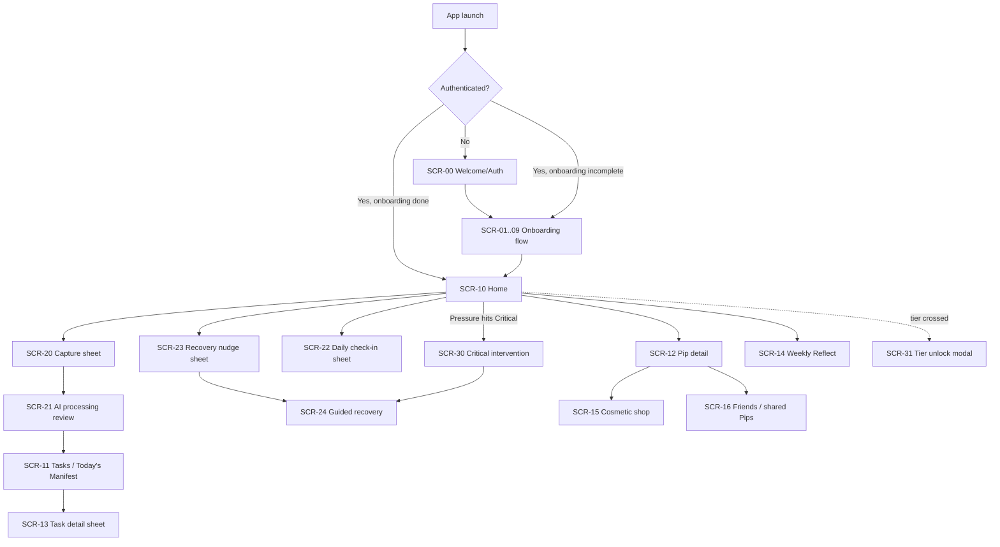

# Pip — Frontend Design Specification
*Companion to `pip-product-spec.md`, `pip-gamification-design.md`, and `pip-onboarding-and-gtd.md`.*
*Target: mobile-first native app, iOS & Android, base viewport 390×844pt (iPhone 14/15). Visual direction: soft/cozy, rounded, warm. Mascot: 3D matte-clay soft-body.*

---

## Design rationale (read first)

Two students with the same timetable are not carrying the same thing, and this app's whole reason to exist is to make an invisible internal load *visible and warm* rather than clinical. So the visual language deliberately avoids the two defaults a wellness/productivity app usually lands on: the cold blue-grey dashboard, and the gamified neon candy look. Instead: a warm off-white paper ground, a soft clay-orange as the living brand color (it's Pip's own color — brand and mascot are the same warmth), a grounding teal as the calm/recovery counterweight, and generous rounding everywhere so nothing has a hard edge. The one place boldness is spent is Pip itself — the mascot is the hero on every primary surface, and the rest of the UI stays quiet so the creature always reads as the emotional focal point.

The state color system (Balanced/Strained/Wilting/Depleted/Critical) is the one exception to "keep it warm and calm": those must be instantly legible, so they map onto the functional semantic ramp (green→amber→red) that users already read as good→caution→urgent.

---

# Phase 1 — Foundational Design System

## 1.1 Color palette & tokens

All values are verified for WCAG 2.1 AA. Where a brand color is used as a **button fill under text**, a darkened `-onFill` variant is specified because the bright display shade fails AA for normal-weight text.

### 1.1.1 Brand colors
| Token | Hex | Role | Notes |
|---|---|---|---|
| `--brand-primary` | `#E8734A` | Clay orange — Pip's body color, primary brand | Display / large text / non-text only |
| `--brand-primary-onFill` | `#BC4A25` | Primary button fill under white text | 5.07:1 on white — AA pass |
| `--brand-primary-soft` | `#FBEAE2` | Primary tint (selected chips, wash) | |
| `--brand-secondary` | `#3B9B8F` | Grounding teal — calm, recovery, secondary | Display / large text / non-text only |
| `--brand-secondary-onFill` | `#2A7A6F` | Teal button fill under white text | 5.11:1 on white — AA pass |
| `--brand-secondary-soft` | `#E2F2EF` | Teal tint | |
| `--brand-accent` | `#FCE79A` | Warm honey — Sparks, XP, celebratory highlights | Non-text / large only |
| `--brand-accent-text` | `#6B4E00` | Text/icon on honey accent | 6.27:1 on `--brand-accent` — AA pass |

### 1.1.2 Neutral & surface scale
| Token | Hex | Role |
|---|---|---|
| `--bg` | `#FBF7F2` | App background (warm paper) |
| `--surface` | `#F5EEE6` | Raised surface / grouped section behind cards |
| `--card` | `#FFFFFF` | Card / sheet fill |
| `--muted` | `#F0E8DE` | Muted fill (skeletons, inactive chips, track) |
| `--border` | `#E7DCCF` | Hairline border (1px) |
| `--border-strong` | `#D8C7B4` | Emphasis border / focus-adjacent |
| `--text-primary` | `#3D2C24` | Primary text — 12.4:1 on bg |
| `--text-secondary` | `#7A6659` | Secondary text — 5.08:1 on bg |
| `--text-disabled` | `#B0A196` | Disabled text — decorative/non-essential only (2.35:1, never load-bearing) |

### 1.1.3 Functional / semantic colors
Each has a `-fill` (tint background), `-text` (AA-passing foreground on that tint), and `-solid` (for solid badges/icons on white).

| Semantic | `-fill` | `-text` (on fill) | `-solid` | Contrast (text on fill) |
|---|---|---|---|---|
| Success | `#E4F5EC` | `#1F6B4A` | `#2E8B60` | 5.70:1 — AA |
| Warning | `#FCF0DA` | `#8A5A0C` | `#C9871A` | 5.25:1 — AA |
| Destructive | `#FBE9E9` | `#9E3535` | `#CF4A4A` | 5.95:1 — AA |
| Info | `#E8F0FB` | `#2A5B96` | `#3B7DD8` | 6.03:1 — AA |

### 1.1.4 Pip state colors (map onto semantic ramp)
| State | Aura/badge fill | Text on fill | Silhouette color (shareable view) |
|---|---|---|---|
| Balanced | `#E4F5EC` (success-fill) | `#1F6B4A` | `#2E8B60` green |
| Strained | `#FCF0DA` (warning-fill) | `#8A5A0C` | `#C9871A` amber |
| Wilting | `#E8F0FB` (info-fill) | `#2A5B96` | `#3B7DD8` blue |
| Depleted & overloaded | `#FBE9E9` (destructive-fill) | `#9E3535` | `#CF4A4A` red |
| Critical | `#9E3535` solid | `#FFFFFF` (4.5:1+) | pulsing red |

### 1.1.5 Semantic token aliases (use these in components, not raw hex)
```
--color-bg / --color-surface / --color-card / --color-muted
--color-border / --color-border-strong
--color-text / --color-text-secondary / --color-text-disabled
--color-action        = --brand-primary-onFill   (primary CTAs)
--color-action-quiet  = --brand-secondary-onFill (secondary CTAs)
--color-focus-ring    = #BC4A25 @ 40% + 2px offset
```

## 1.2 Typography

**Family pairing.** One rounded humanist sans across the whole product, plus a mono for numeric detail. The rounded sans reinforces the soft/cozy direction without needing a second display face — Pip is the personality, the type stays friendly and quiet.

- **Display & body:** `Nunito` (rounded terminals, warm) — weights 400/600/700/800.
  - iOS fallback stack: `Nunito, -apple-system, "SF Pro Rounded", system-ui, sans-serif`
  - Android fallback: `Nunito, "Google Sans", Roboto, sans-serif`
- **Numeric / mono:** `Nunito Sans` is *not* used; for the rare raw-number detail readout (Pressure/Vitality on tap) use `"SF Mono", "Roboto Mono", ui-monospace, monospace` at Body-SM size.

**Type scale** (mobile; px = pt at 1×):
| Token | Size / Line-height | Weight | Use |
|---|---|---|---|
| `H1` | 28 / 34 | 800 | Screen title on hero screens, Pip name reveal |
| `H2` | 22 / 28 | 700 | Section headers, sheet titles |
| `H3` | 18 / 24 | 700 | Card titles, domain names |
| `H4` | 16 / 22 | 600 | Sub-labels, list-row titles |
| `Body-LG` | 17 / 26 | 400 | Primary reading text, onboarding prompts |
| `Body-MD` | 15 / 22 | 400 | Default body, list secondary text |
| `Body-SM` | 13 / 18 | 400 | Metadata, helper text, timestamps |
| `Caption` | 11 / 14 | 600 | Chip labels, badges (sentence case, never all-caps) |
| `Num-MD` | 15 / 20 | 500 mono | Raw score readouts |

Line length target: ≤ 60 characters for Body-LG onboarding copy (single-column, 16px side padding on 390px = 358px text column ≈ comfortable).

## 1.3 Spatial & shape tokens

**Spacing (8pt grid, with a 4pt half-step):**
```
--space-0: 0     --space-1: 4    --space-2: 8    --space-3: 12
--space-4: 16    --space-5: 24   --space-6: 32   --space-7: 48   --space-8: 64
```
Default screen side padding: `--space-4` (16px). Card internal padding: `--space-4` (16px). Section vertical gap: `--space-5` (24px).

**Corner radius:**
```
--radius-sharp: 0      (dividers only)
--radius-sm:    8      (chips, small inputs, badges)
--radius-md:    14     (buttons, list rows, input fields)
--radius-lg:    22     (cards, sheets top corners)
--radius-xl:    28     (Pip habitat container, hero cards)
--radius-full:  999    (pills, avatar, FAB, streak dots)
```
The soft/cozy direction lives largely in radius: nothing interactive is below `--radius-md`. Sheets use `--radius-lg` on top corners only.

**Elevation / shadow (warm-tinted, not neutral grey — grey shadows read cold and templated):**
```
--elev-0: none
--elev-1: 0 1px 2px rgba(61,44,36,0.06)                          (chips, resting rows)
--elev-2: 0 2px 8px rgba(61,44,36,0.08)                          (cards)
--elev-3: 0 6px 20px rgba(61,44,36,0.10)                         (bottom sheets, FAB)
--elev-4: 0 12px 32px rgba(61,44,36,0.14)                        (Critical intervention overlay, dialogs)
```

**Motion tokens:**
```
--motion-fast:   140ms ease-out      (taps, chip select, toggles)
--motion-base:   240ms cubic-bezier(0.22,0.61,0.36,1)   (sheets, page transitions)
--motion-pip:    600ms cubic-bezier(0.34,1.56,0.64,1)   (Pip state transitions — gentle overshoot for "breath")
--motion-celebrate: 900ms ease-out   (Spark/XP award, tier unlock)
```
Respect `prefers-reduced-motion`: replace Pip's idle/transition animation with a static state swap and a cross-fade; keep celebration to a single fade, no bounce.

---

# Phase 2 — Mascot Visual Identity & State Sheet

The full mascot specification — character concept and art direction, the reusable base render prompt, generative-prompt deltas for every core and journey state, and the asset delivery matrix — lives in its own file: **`pip-mascot-identity.md`**. It was separated so the mascot can be briefed to illustrators or fed to image generators as a self-contained document. Which mascot state loads on each screen is noted per-screen in Phase 4 below.

---
# Phase 3 — Screen Flow & Navigation Architecture

## 3.1 Navigation shell

**Persistent bottom tab bar** (the app's spine), height 56pt + safe-area inset, `--card` fill, `--elev-3` upward, top hairline `--border`. Four tabs + a center action:

```
[ Home ]   [ Tasks ]   ( + Capture FAB )   [ Pip ]   [ Reflect ]
```
- Tabs: icon 24px + Caption label. Active = `--brand-primary-onFill` icon+label + 3px top indicator bar; inactive = `--text-secondary`.
- **Center Capture FAB:** 56px circle, `--brand-primary-onFill` fill, white `+` (or `feather`/`mic` icon), raised 12px above the bar (`--elev-3`), `--radius-full`. This is the mind-dump entry — reachable from anywhere.
- Icons: `home`, `check-square` (Tasks), `smile`/custom Pip glyph, `refresh-cw`/`sun` (Reflect).

The bottom bar is hidden during: onboarding, full-screen Critical intervention, and any full-screen sheet flow (capture, guided recovery).

## 3.2 Route map & transition patterns

| Pattern | Used for |
|---|---|
| **Full-page push** (slide-in-from-right, `--motion-base`) | Tab roots, domain detail, settings |
| **Bottom sheet** (slide-up, `--radius-lg` top, drag-handle, `--motion-base`) | Capture, AI processing review, recovery nudge, check-in, task detail |
| **Full-screen modal** (fade + scale, `--motion-base`) | Critical intervention, onboarding steps, tier-unlock celebration |
| **Inline expand** (height auto, `--motion-fast`) | Manifest item expand, domain baseline card |
| **Redirect** | Auth/permission gates (below) |

## 3.3 Global user journey (Mermaid)



## 3.4 State & permission gates

| Condition | Behavior |
|---|---|
| **Guest / not authenticated** | Route to `SCR-00`. No tab bar. Only Welcome + auth reachable. |
| **Authenticated, onboarding incomplete** | Force-route into onboarding at last-incomplete step; deep links deferred until complete. |
| **Authenticated, onboarding complete** | Land on `SCR-10 Home`. Full shell. |
| **Notifications permission not granted** | App works fully; forecast/nudge features show a one-line inline "Turn on reminders" prompt in Reflect, never a blocking modal. |
| **Calendar/LMS not connected** | Import features hidden; manual capture unaffected. |
| **Offline** | Capture, check-in, task complete, and Pip state all work locally (event-sourced, per spec §5.1). A slim `--warning-fill` bar reads "Offline — changes will sync." Social/shop disabled with skeleton + retry. |
| **Friend hasn't opted into sharing** | Their Pip slot simply doesn't render in `SCR-16` (no empty placeholder, no error). |
| **Cold-start (days 1–7)** | Scores badged "Estimating…"; no calibration nudges; forecast thresholds widened (per onboarding §A.9). |

---

# Phase 4 — Screen-by-Screen Blueprint

*Convention: all coordinates assume a 390pt-wide viewport, 16px (`--space-4`) default side padding → 358px content column. "Below" = vertical gap in the stack. Zones listed top-to-bottom.*

---

## SCR-00 — Welcome / Auth
**Route:** `/welcome` · **Goal:** get the user into onboarding. **Primary CTA:** "Get started."

**Zones:** Status-safe top pad → Mascot hero zone → Copy block → Auth actions (sticky bottom).

**Components (top→bottom):**
1. **Mascot hero** — `Welcome/hatchling` Pip, container `220×220px`, centered horizontally, anchored 96px below top safe-area. Soft honey radial wash (`--brand-accent` at 20%) behind, `--radius-full`, 260px.
2. **H1 title** — "Meet Pip." centered, `--text-primary`, 24px below mascot.
3. **Body-LG subtitle** — "A companion that carries what you carry — and helps you set it down." centered, `--text-secondary`, max 2 lines, 8px below H1.
4. **Sticky bottom action group** — container pinned to bottom, 16px side pad, 24px above safe-area:
   - **Primary button** — full-width, 52px height, `--radius-md`, `--brand-primary-onFill` fill, white H4 label "Get started." `--elev-2`.
   - **Text button** — full-width, 44px, transparent, `--brand-secondary-onFill` label "I already have an account." 8px below primary.

**States:**
- *Initial load:* mascot fades+scales in (`--motion-pip`) once; text follows at +120ms. Single orchestrated entrance, nothing else animates.
- *Primary pressed:* button fill darkens 8%, scales 0.98, `--motion-fast`.
- *Auth in progress:* primary label swaps to inline 18px spinner, button disabled (opacity 0.6), rest of screen non-interactive.
- *Auth error:* `--destructive-fill` inline bar above button group, `--destructive-text`, "Couldn't sign in. Check your connection and try again." Dismisses on retry.

---

## SCR-01–09 — Onboarding flow
Shared chrome for all onboarding steps:

**Zones:** Progress header (fixed) → Step body (scroll) → Sticky footer nav.
- **Progress header:** 56px, `--bg`, a segmented progress bar (9 segments, 4px tall, `--radius-full`, filled = `--brand-primary`, empty = `--muted`), a left `chevron-left` back button (44×44 tap target, hidden on step 1), and a right "Skip" text button only on skippable steps.
- **Sticky footer:** 16px pad, single full-width 52px primary button, label context-dependent ("Continue" / "Confirm" / "Finish"). Disabled (opacity 0.5, non-interactive) until the step's minimum input is satisfied.

### SCR-02 — Meet & name Pip
**Route:** `/onboarding/name` · **Goal:** name the pet, first emotional hook. **CTA:** "Continue."
1. **Mascot zone** — `Welcome/hatchling` Pip `180×180px`, centered, 32px below header.
2. **H2** — "What should we call your Pip?" centered, 24px below mascot.
3. **Text input** — full-width, 52px, `--radius-md`, `--card` fill, 1px `--border`, 16px inner pad. Placeholder "Name your Pip". Center-aligned text, H4 weight. Character counter (max 20) bottom-right in Caption/`--text-secondary`, appears only after first keystroke.
4. **Skin selector** — horizontal row of 4 circular swatches (`56px`, `--radius-full`, 12px gap), centered, 24px below input. Selected = 2px `--brand-primary` ring + 3px offset; unselected = 1px `--border`.

*States:* input focus = 2px `--brand-primary` ring, `--motion-fast`. Empty name = footer disabled. Skin tap = Pip in mascot zone recolors live (`--motion-pip`).

### SCR-03 — Domain discovery (AI conversation)
**Route:** `/onboarding/discover` · **Goal:** elicit Life Domains conversationally. **CTA:** "Continue" (enabled after ≥1 exchange).

**Zones:** Progress header → Conversation scroll → Composer (sticky above footer).
1. **Small Pip anchor** — `Listening` Pip `64×64px`, pinned top-left of the conversation area, sticky as the user scrolls (stays visible while typing).
2. **Prompt bubble** (assistant) — left-aligned, max 300px, `--card` fill, `--radius-lg` (bottom-left corner `--radius-sm`), 12px pad, Body-MD. First bubble: "Tell me what a normal week looks like — classes, work, clubs, sport, anything that takes your time or energy."
3. **User bubble** — right-aligned, `--brand-primary-soft` fill, `--radius-lg` (bottom-right `--radius-sm`), Body-MD `--text-primary`.
4. **Composer** — sticky, 56px, `--card`, top hairline. Text field (grows to 4 lines max) + 40px circular `mic` button + 40px `send` button (`--brand-primary-onFill`, disabled until text present).
5. **Template fallback link** — Body-SM text button below composer on first view: "Prefer to pick from a list?" → opens SCR-04 template picker path.

*States:*
- *AI thinking:* `Thinking` Pip swaps in at the anchor; a 3-dot typing indicator bubble appears (`--muted`, animated).
- *Loading skeleton:* on step entry, one shimmer prompt-bubble skeleton before first real bubble.
- *Error (AI unreachable):* inline `--warning-fill` bubble "I'm having trouble right now — want to pick from a list instead?" with a button to the template path.

### SCR-04 — Domain confirmation
**Route:** `/onboarding/domains` · **Goal:** review/edit extracted domains. **CTA:** "Confirm domains."
1. **H2** — "Here's what I heard." 24px below header.
2. **Body-SM helper** — "Add, rename, or remove anything." `--text-secondary`, 4px below H2.
3. **Domain card list** — vertical stack, 12px gap, 16px below helper. Each card: `--card`, `--radius-lg`, `--elev-1`, 14px pad, 64px min height:
   - Row: **domain name** (H4, editable inline — tap reveals cursor + `edit-2` icon right), below it a **category-tag chip** = the domain's own name echoed as its tag color (per your correction: the tag *is* the domain, no generic mapping), Caption on a tinted chip.
   - Trailing `x` (24px, `--text-secondary`) to remove.
4. **Add-domain row** — dashed 1px `--border-strong`, `--radius-lg`, 52px, centered `plus` + "Add a commitment", `--brand-secondary-onFill`.

*States:* empty (no domains extracted) = a single friendly card "I didn't catch any — let's add them" + the add row. Removing a card = slide-left + collapse (`--motion-base`).

### SCR-05 — Per-domain baseline
**Route:** `/onboarding/baseline/:domainId` · **Goal:** quantify each domain. **CTA:** "Next domain" / "Continue" on last.

Repeats per domain. Top shows a small counter "Domain 2 of 4" (Body-SM, `--text-secondary`).
1. **Domain title** — H2, the domain name, 20px below header.
2. **Hours slider card** — `--card`, `--radius-lg`, 16px pad. Label "Roughly how many hours a week?" (H4). Slider track `--muted`, filled `--brand-primary`, thumb 28px `--radius-full` white + `--elev-2`. Live value pill (`--brand-primary-soft`, Caption) above thumb.
3. **Drain↔Fulfillment card** — same card style, 12px below. Label "How does it feel to do?" A horizontal slider with a frown icon (`--destructive-solid`) at left, heart icon (`--success-solid`) at right, teal→neutral→orange gradient track. Center-neutral. Value label updates: "Draining · Neutral · Fulfilling."
4. **Volatility segmented control** — 12px below. Label "Is it steady or spiky?" Two-segment control (`Steady` / `Spiky`), `--radius-md`, selected = `--brand-secondary-soft` + `--brand-secondary-onFill` text.

*States:* untouched sliders default to mid; footer enabled immediately (defaults are valid). Each card animates in with a 40ms stagger on step entry.

### SCR-06 — Whole-person baseline
Adaptive question cards (sleep always; connection/outlook conditional). Same card+slider vocabulary as SCR-05. Skipped questions simply don't render — no empty placeholders.

### SCR-07 — Integrations
Two connect rows (Calendar, LMS), each a `--card` row with service icon, name, and a `Connect` pill button (`--brand-secondary-onFill` outline). Footer label "Skip for now" is allowed here.

### SCR-08 — First reveal
**Route:** `/onboarding/reveal` · **Goal:** the payoff. No footer nav — a single centered "Meet your Pip" primary button.
1. **Full-bleed habitat** — `--brand-accent` soft wash background, `--radius-xl` inset card 358px.
2. **Pip** — rendered in the *actual computed starting state* (not always Balanced) at `220×220px`, centered. Entrance: `--motion-pip` scale-in with the contact shadow settling.
3. **H1** — "{pip.name} is ready." 24px below.
4. **Body-MD** — one honest line reflecting their baseline, e.g. "Looks like you're already carrying a fair bit — let's keep an eye on it together." Dynamic-bound to state.

### SCR-09 — Interactive tutorial
Coach-mark overlay sequence over a sandboxed Home: dark scrim `rgba(61,44,36,0.55)` (`--elev-4`), a spotlight cutout on the target (FAB, then Pip, then check-in), each with a `--card` tooltip (`--radius-md`, 14px pad, Body-MD + "Next" text button). Skippable top-right.

---

## SCR-10 — Home
**Route:** `/home` · **Goal:** at-a-glance state + entry to the daily loop. **Primary CTA:** capture (FAB) / check-in.

**Zones:** Header → Pip hero → Status strip → Today preview → Nudge slot → (tab bar).
Scroll: vertical, header non-sticky, tab bar fixed.

**Components:**
1. **Header** — 56px. Left: greeting H4 "Morning, {user.firstName}" + date Body-SM `--text-secondary` beneath. Right: 40px `--radius-full` streak pill showing `flame` icon + Balance-Streak count (`--brand-accent` fill, `--brand-accent-text`). Tapping streak → Reflect.
2. **Pip hero zone** — `--brand-accent` soft radial habitat, `--radius-xl`, full content-width, 300px tall, 16px below header.
   - Live-state Pip `220×220px` centered, current core state animated idle.
   - Habitat streak dots: a row of small `--radius-full` lanterns along the base, one lit per streak day (max 7 shown, "+N" pill after).
   - Tapping Pip → SCR-12 Pip detail.
3. **Status strip** — a single `--card` row, `--radius-lg`, `--elev-2`, 14px pad, 16px below hero. Two-up: **Pressure** (label Caption + a horizontal capacity bar, fill color = current state semantic) and **Vitality** (label + bar, teal fill). Raw numbers hidden; a `chevron-right` opens detail. During cold-start, an "Estimating…" `--info-fill` Caption chip sits on the strip.
4. **Today preview card** — `--card`, `--radius-lg`, 16px below. H4 "Today" + count. Up to 3 manifest rows (checkbox + task title Body-MD + domain chip). Footer text button "See all →" → Tasks tab.
5. **Nudge slot (conditional)** — appears only when a recovery nudge is active: `--brand-secondary-soft` card, `--radius-lg`, sprout icon + Body-MD nudge text + "Later"/"Do it" buttons. Matches the lowest sub-stat.

**States:**
- *Loading:* Pip hero shows a static Balanced silhouette + shimmer; status strip and cards show skeleton bars (`--muted`, shimmer), not spinners.
- *Empty (day 1, no tasks):* Today card shows `Empty` Pip mini + "Nothing scheduled yet. Tap + to brain-dump what's on your mind." with an arrow pointing toward the FAB.
- *Critical reached (live):* Home auto-presents SCR-30 as a full-screen modal; Pip hero itself shifts to the Critical render underneath.
- *Check-in not done today:* status strip shows a gentle `--info-fill` "How are you feeling?" tappable prompt → SCR-22.

---

## SCR-11 — Tasks / Today's Manifest
**Route:** `/tasks` · **Goal:** work the capacity-sized daily list. **CTA:** complete tasks / capture.

**Zones:** Header → Context filter row → Manifest list → (FAB overlaps).
1. **Header** — 56px, H2 "Today", right-side `sliders` icon (sort/filter).
2. **Context filter chips** — horizontal scroll row, 8px gap, 12px vertical pad: `All`, `@library`, `@online`, `@errands`, `@low-energy`. Chip = `--radius-full`, 32px, Caption. Selected = `--brand-primary-soft` fill + `--brand-primary-onFill` text; rest `--muted`.
3. **Capacity note** — Body-SM `--text-secondary`, e.g. "Sized to your capacity — 4 of 9 shown." When Pressure high: "You're near capacity, so today's list is short." in `--warning-text`.
4. **Manifest list** — vertical, 8px gap. Each row = `--card`, `--radius-md`, `--elev-1`, 56px min, 14px pad:
   - Left: 24px circular checkbox (`--border-strong` ring; checked = `--success-solid` fill + white `check`).
   - Center: task title H4 (strikethrough + `--text-disabled` when done) + domain chip Caption beneath.
   - Right: due Body-SM + `grip`/drag affordance.
   - Tap row → SCR-13 task detail sheet. Swipe-right = complete; swipe-left = reschedule/defer actions (`--info-solid` / `--warning-solid` action backgrounds).

**States:**
- *Loading:* 5 skeleton rows.
- *Empty (all done):* `Celebrating` Pip `132px` + H3 "That's your capacity for today." + Body-MD "Rest is productive too." No "add more" pressure.
- *Empty (nothing captured):* `Empty` Pip + prompt to capture.
- *Completing a task:* checkbox fills, row does a `--motion-fast` settle, a `+Care` / Spark micro-toast rises from it; low-confidence tasks trigger the calibration check sheet (below).
- *Calibration check (conditional, ≤1/day):* small bottom sheet "Was that as heavy as we guessed?" with the predicted effort shown and a 3-step slider (Lighter / Right / Heavier). Skippable.

---

## SCR-12 — Pip detail
**Route:** `/pip` · **Goal:** understand current state + access shop/social. **CTA:** view detail / customize.
1. **Large Pip stage** — `--brand-accent` habitat, `--radius-xl`, 340px, Pip at `220px` with current accessories/tier aura rendered.
2. **State caption** — H3 current state name (state-colored) + Body-MD plain-language explanation, e.g. "Puffed up — you're carrying a lot right now." centered below stage.
3. **Sub-stat breakdown** — 2×2 grid of mini-cards (Rest/Physical/Mood/Connection), each `--card`, `--radius-md`, icon + label + a small bar. Lowest sub-stat card gets a `--brand-secondary` 2px ring + "focus here" Caption.
4. **Raw detail (expandable)** — a `chevron` row "See the numbers" expands to show Pressure/Vitality as `Num-MD` mono values. Collapsed by default.
5. **Action row** — two buttons: "Shop" (→SCR-15) and "Friends" (→SCR-16), 48px, `--radius-md`, `--brand-secondary` outline.

*States:* loading = habitat + silhouette + skeleton sub-stat grid. Reduced-motion = static Pip, no idle.

---

## SCR-13 — Task detail (bottom sheet)
**Route:** `/tasks/:id` (sheet) · **Goal:** view/edit one task.
Sheet: `--radius-lg` top, drag handle (32×4px `--border-strong`, centered, 8px top), max 90% height, `--elev-3`.
1. Drag handle → 2. Task title (H2, editable) → 3. Meta row: domain chip + due date pill + context chip → 4. Sub-task checklist (if split), each a mini checkbox row → 5. Notes field (multiline, `--card`, `--radius-md`) → 6. Sticky sheet footer: "Complete" primary (52px, `--brand-primary-onFill`) + "Reschedule" secondary text button.

*States:* editing title = inline focus ring; delete = confirm inline (`--destructive-fill` "Delete this task?" with Cancel/Delete). Loading = skeleton meta + title shimmer.

---

## SCR-14 — Weekly Reflect
**Route:** `/reflect` · **Goal:** review the week, confirm calibration, preview ahead. **CTA:** "Accept" adjustments / "Done."

**Zones:** Header → Week-summary hero → Trend section → Calibration proposals → Forecast preview.
1. **Header** — H2 "Your week", Body-SM date range.
2. **Summary hero** — `--card`, `--radius-lg`, `--elev-2`: completed vs deferred counts (two big `Num` figures), Balance-Streak status line. If streak reset this week: `--info-fill` note "Your streak reset — your progress didn't."
3. **Trend section** — H3 "How you carried it." A small multi-line/bar chart of the four sub-stats across 7 days (state-colored strokes), `--card`, `--radius-lg`. (Chart is the one data-viz moment; keep it flat, no gridline clutter.)
4. **Calibration proposals (conditional)** — each proposed change a `--card` row: plain-language "Barista shifts felt heavier than you set — weigh them more?" + "Accept" (`--brand-secondary-onFill`) / "Keep as is" buttons. Never auto-applied.
5. **Forecast preview** — H3 "Week ahead." A 7-day strip; risk days flagged with a `--warning-solid` dot + the contributing domain names.

*States:* not-enough-data (week 1) = friendly `Resting` Pip + "Come back after a few days — I'm still learning your rhythm." Loading = skeleton hero + chart shimmer. No proposals = section omitted entirely.

---

## SCR-15 — Cosmetic shop
**Route:** `/pip/shop` · **Goal:** spend Sparks on cosmetics. **CTA:** "Get" per item.
1. **Header** — H2 "Shop", right: Sparks balance pill (`--brand-accent`, `star` icon + `Num-MD`).
2. **Category tabs** — scroll chips: Skins / Hats / Habitat / Auras.
3. **Item grid** — 2-col, 12px gutter. Each tile `--card`, `--radius-lg`: item preview image (1:1, 150px), name H4, price row (`star` + cost), "Get" button (disabled + `--muted` if unaffordable). Owned = `check` "Owned" chip.

*States:* purchase = `Celebrating` Pip micro-anim + balance decrements with a count-down tween; item applies to Pip immediately. Insufficient Sparks = button disabled, Caption "Earn more by staying balanced." Loading = 6 skeleton tiles.

---

## SCR-16 — Friends / shared Pips
**Route:** `/pip/friends` · **Goal:** coarse check on friends, delegation context. **CTA:** add friend.
1. **Header** — H2 "Friends", right `user-plus`.
2. **Sharing toggle card** — `--card`: "Share my Pip's state" switch + Body-SM "Friends see only a color, never your numbers or tasks."
3. **Friend list** — rows: friend `Silhouette` Pip (44px, state-tinted color only), name H4, state word Caption in state color. No numbers. Tap = send-encouragement sheet.

*States:* empty = "Add a friend to check in on each other." A friend not sharing = omitted silently (per gate). Loading = 4 skeleton rows. Offline = disabled with retry.

---

## SCR-20 — Capture (bottom sheet)
**Route:** `/capture` (sheet) · **Goal:** frictionless mind-dump. **CTA:** "Process" / "Save for later."
Full-height sheet, `--radius-lg` top.
1. Drag handle → 2. H3 "What's on your mind?" → 3. **Multiline text area** — auto-focus, `--card`, min 120px, Body-LG, placeholder "Dump it all here — one thing or ten. I'll sort it out." → 4. **Attachment row** — `mic` (voice), `image` (screenshot), `paperclip` — 44px circular buttons, `--brand-secondary` outline, 12px gap → 5. Chips of added attachments below → 6. **Sticky footer:** "Process now" primary (`--brand-primary-onFill`) + "Save for later" text button (stores as `unprocessed`).

*States:* empty = footer disabled. Recording = mic pulses `--destructive-solid`, waveform + timer replace attachment row. Voice transcribing = inline spinner + "Transcribing…". Processing tapped → transitions to SCR-21.

---

## SCR-21 — AI processing review (bottom sheet)
**Route:** `/capture/review` · **Goal:** confirm AI-structured tasks before commit. **CTA:** "Add these" / edit.
1. Drag handle → 2. `Thinking`→settled Pip 64px + H3 "Here's how I'd break this down." → 3. **Proposed task cards** — each: title (editable H4), matched **domain chip** (or a `--info-fill` "New domain?" chip if unmatched), suggested date pill, effort estimate. Sub-tasks shown indented for split items. Each card has an inline `x` to reject → 4. "Just do it now" section: 2-minute-rule trivial items listed separately with a lightning icon → 5. **Sticky footer:** "Add {n} tasks" primary + "Edit more" secondary.

*States:* processing (before results) = 3 shimmer task-card skeletons + `Thinking` Pip. Empty (nothing actionable found) = "I didn't find any clear tasks — want to save this as a note?" Low-confidence estimates get a small `help-circle` marker flagging a future calibration check.

---

## SCR-22 — Daily check-in (bottom sheet)
**Route:** `/checkin` · **Goal:** 2-tap mood/stress log. **CTA:** auto-commits on select.
Compact sheet (~40% height).
1. Drag handle → 2. H3 "How are you feeling?" → 3. **Mood slider** — large horizontal, 5 stops, emoji-free: uses Pip-face micro-states from very-low to very-good along the track; thumb 32px. Track gradient `--info` (low) → `--success` (good) → warm. → 4. Optional domain tag chips ("about anything in particular?") → 5. Footer: single "Done" (auto-enabled once slider moved).

*States:* on submit = sheet dismisses, Home Pip re-renders (`--motion-pip`) reflecting the new Mood sub-stat, a `+Care` micro-toast. Reduced-motion = cross-fade.

---

## SCR-23 — Recovery nudge (bottom sheet)
**Route:** `/nudge` · **Goal:** offer a matched recovery action. **CTA:** "Start" / "Later."
Sheet keyed to lowest sub-stat:
1. Drag handle → 2. `Resting` Pip 88px → 3. H3 matched to sub-stat ("You've been running low on rest.") → 4. Body-MD concrete suggestion → 5. Footer: "Start" primary (→ SCR-24 for guided, or logs directly) + "Maybe later" text button.

*States:* dismiss ≠ penalty (no streak effect). "Start" on a loggable action = immediate `+Care` + Pip re-render.

---

## SCR-24 — Guided recovery
**Route:** `/recover/:type` · **Goal:** run a short recovery activity. **CTA:** breathing/break timer.
Full-screen, calm `--brand-secondary-soft` ground, tab bar hidden.
1. Duration segmented control (2 / 5 / 10 min).
2. **Breathing visual** — a large soft `--radius-full` orb that scales with the breath cycle (Pip's `Resting` face faintly inside), `--motion` synced to inhale/exhale.
3. Time remaining `Num` below.
4. Footer: "End" text button.

*States:* on completion = auto-logs as recovery action, `Celebrating`→`Resting` Pip transition, "+Care" + a re-saturation of Pip's color as a visible reward. Reduced-motion = the orb steps between two sizes with a cross-fade instead of continuous scale.

---

## SCR-30 — Critical intervention (full-screen modal)
**Route:** `/critical` · **Goal:** calm, supportive de-escalation. **CTA:** log one recovery action. **This screen is never punishing.**
Full-screen, `--elev-4` scrim, tab bar hidden, not dismissible by back-swipe (must choose an action or "Not now").
1. **Pip** — Critical render (`Pressure-driven` or `Vitality-driven` per `critical_cause`), `220px`, centered, with the pulsing outline.
2. **H2** — cause-framed: Pressure → "Let's set something down." / Vitality → "Let's get you some rest."
3. **Body-LG** — one supportive line, no stats, no blame.
4. **Single primary action** — "Log one thing that helps" (52px, `--brand-secondary-onFill`) → SCR-24 or recovery log. A quiet "Not now" text button below.

*States:* on action logged = Pip does the exhale/deflate `--motion-pip`, outline fades, screen transitions to a soft "Settling…" confirmation, then dismisses to Home showing the recovered state. Never shows a failure/score-loss message. Reduced-motion = static deflate cross-fade.

---

## SCR-31 — Tier unlock (celebration modal)
**Route:** `/unlock` (modal) · **Goal:** reward earned progress. **CTA:** "See it on Pip."
Centered dialog card, `--radius-xl`, `--elev-4`, `--brand-accent` soft top wash.
1. `Tier-unlock` Pip wearing the new accessory, 180px.
2. H2 "You reached {tier.name}!"
3. Body-MD what unlocked.
4. Primary "See it on Pip" + "Later" text button.

*States:* entrance = single `--motion-celebrate` honey-sparkle burst (respects reduced-motion → fade). Never interrupts a Critical state (queued until after recovery).

---

## Appendix — Component state reference (applies globally)

**Primary button** (`--brand-primary-onFill`, white H4, 52px, `--radius-md`):
- Default `--elev-2` · Hover/pressed: fill −8% L, scale 0.98, `--motion-fast` · Focus: 2px `--color-focus-ring` + 2px offset · Disabled: opacity 0.5, no elevation, non-interactive · Loading: label→18px spinner, disabled.

**Secondary button** (transparent, 1.5px `--brand-secondary-onFill` border, label same): mirrors above; pressed fills `--brand-secondary-soft`.

**Input field** (52px, `--radius-md`, `--card`, 1px `--border`):
- Focus: 2px `--brand-primary` ring · Error: 1.5px `--destructive-solid` border + Body-SM `--destructive-text` message 4px below + `alert-circle` 16px leading the message · Success: 1.5px `--success-solid` + `check` · Char counter: Caption `--text-secondary`, turns `--destructive-text` at limit.

**Card** (`--card`, `--radius-lg`, `--elev-2`, 16px pad): pressed (if tappable) scale 0.99 + `--elev-1`.

**Chip** (`--radius-full`, 32px, Caption): default `--muted`/`--text-secondary`; selected `--brand-primary-soft`/`--brand-primary-onFill`; never all-caps.

**Skeleton:** `--muted` base with a left→right shimmer (`--motion` 1.2s loop); used for all list/card/stat loads. Spinners are reserved for in-button and inline transcription only.

**Toasts / micro-rewards:** rise 12px + fade, `--motion-base`, auto-dismiss 1.8s, `--brand-accent` for Spark/XP, `--brand-secondary-soft` for Care.

**Focus & a11y floor:** every interactive element ≥44×44pt tap target, visible focus ring, `prefers-reduced-motion` honored everywhere Pip animates, all text/badge pairs verified AA (Phase 1), state never conveyed by color alone (state always carries a word + a shape/posture on Pip).
